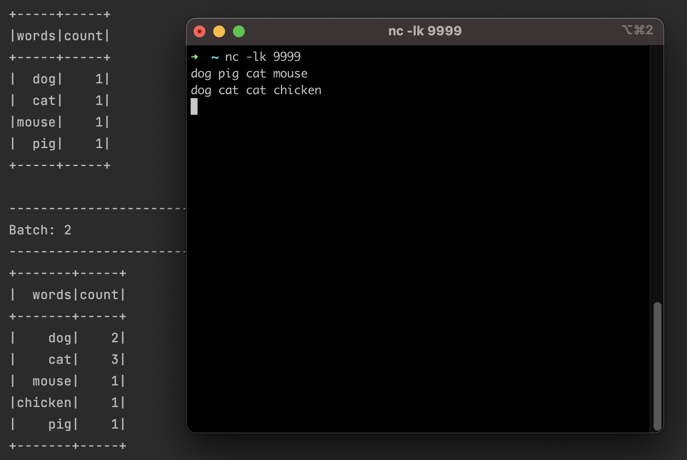
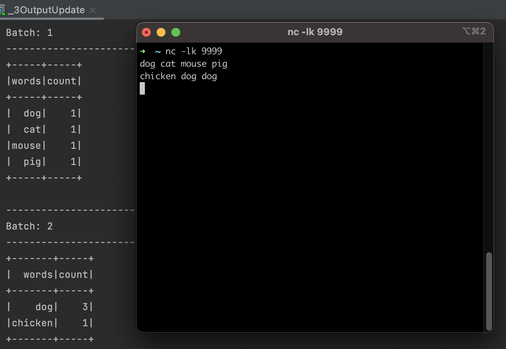
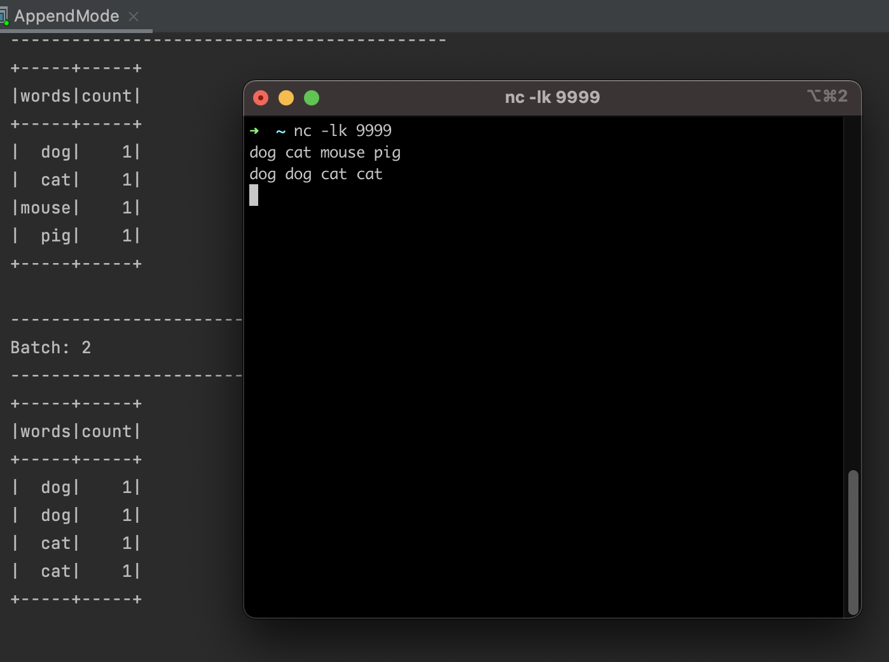
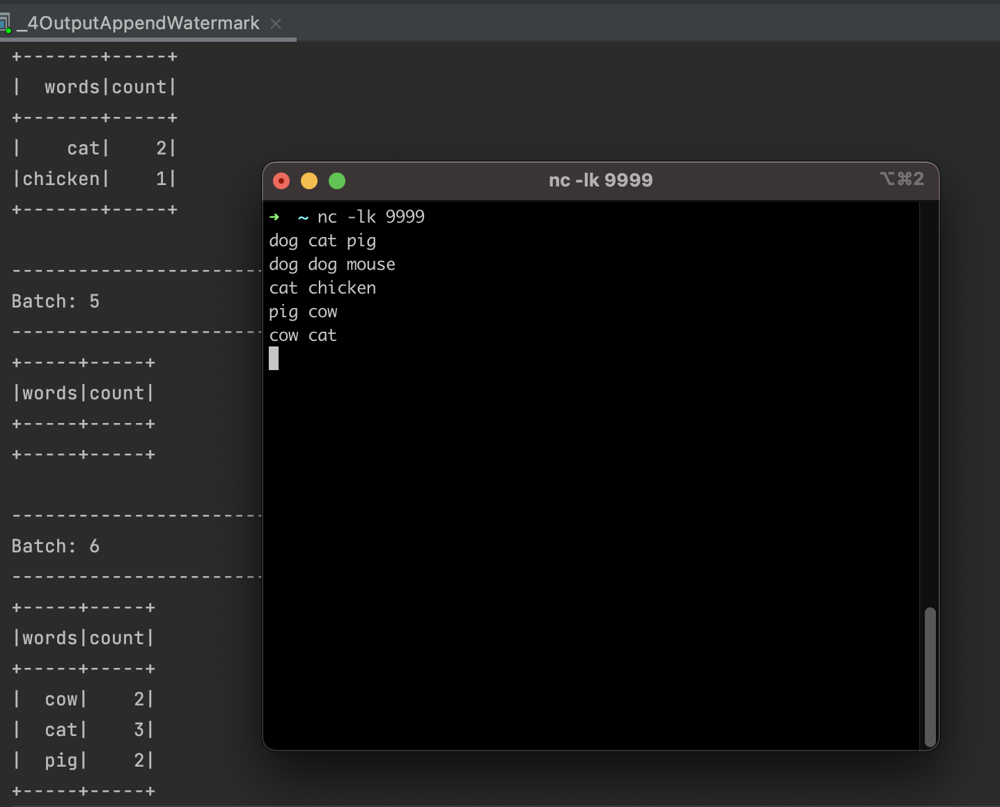
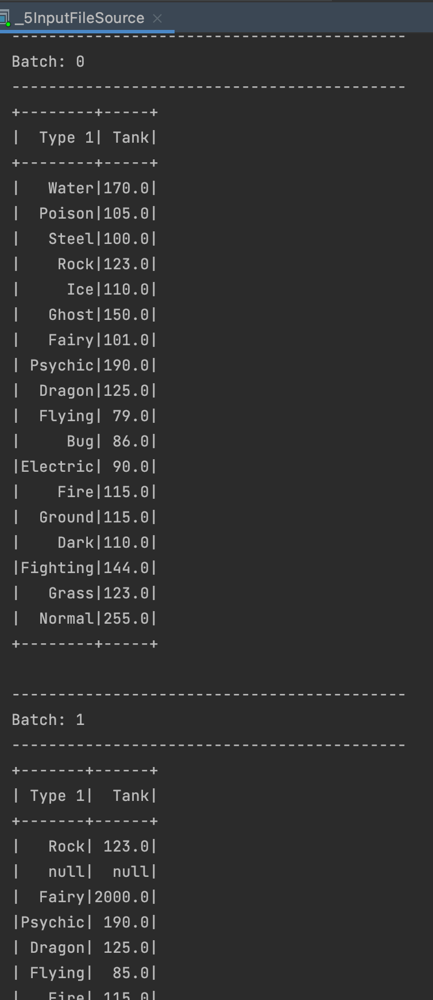
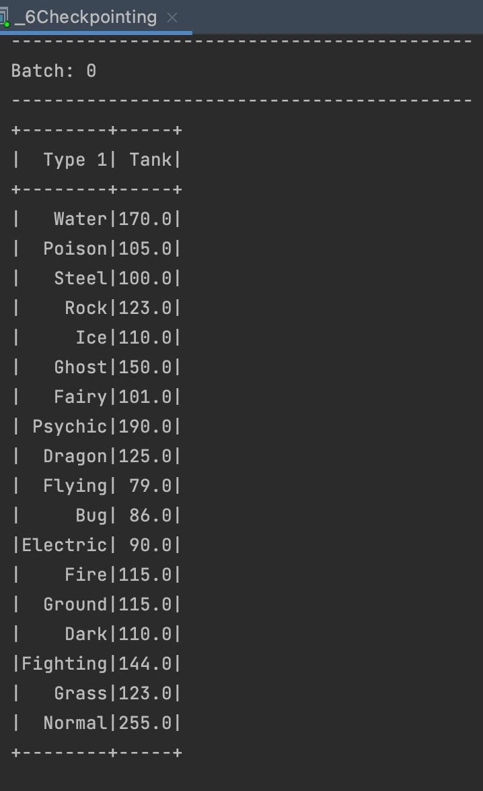
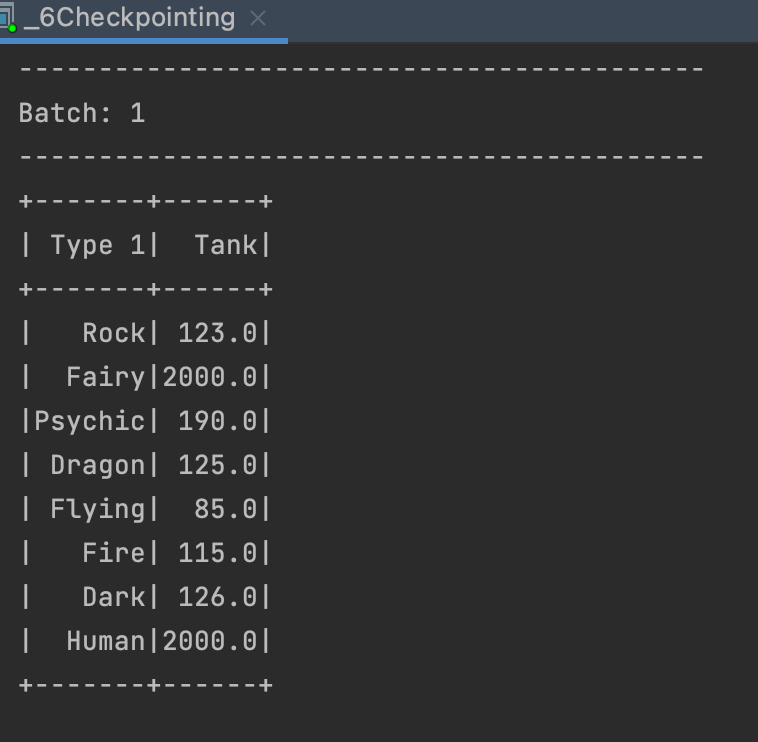

# Learning Spark Streaming

# DStreams: Using Spark Context
- [Spark streaming quick start](https://spark.apache.org/docs/latest/streaming-programming-guide.html)
- Dstream represented as a sequence of RDDs
- Low level 

# Structured Streaming
- takes advantage of Spark SQL
- powerful abstractions like Dataset/DataFrame APIs as well as SQL (vs dealing with RDDs)
- Micro-batching

## Output Modes
3 output modes:
1. Append (default)
2. Complete
3. Update

### Complete


The whole Result Table will be outputted to the sink after every trigger. This is supported for aggregation queries.

> Complete output mode not supported when there are no streaming aggregations on streaming DataFrames/Datasets;

### Update


Only the rows in the Result Table that were updated since the last trigger will be outputted to the sink

### Append

If we were to use the same code as complete/update output modes and groupby word and count, it will fail with error:
> Append output mode not supported when there are streaming aggregations on streaming DataFrames/DataSets without watermark;

This is because append mode is used when new rows are added to result table. This mode guarantees that each row will be output only once (assuming fault-tolerant sink).
Code is modified to remove aggregration (hardcode count as literal 1)


Supported for only those queries where rows added will never change:
- select
- where
- flatMap / map
- filter
- join etc

#### Watermarking
- Watermarking is a way to help deal with lateness. It defines a threshold for the system to wait for late events.
- If event arrives within watermark/threshold, it will be part of the update.
- Helps with fault tolerance and out of order data
- Supports either update or append output modes

- Add option to include timestamp
```
spark.readStream.option("includeTimestamp",  true) 
```

- use withWatermark (eventTime column and threshold)
```
words.withWatermark("timestamp", "2 minutes") // late arrivals of up to 2 mins
```
Note: withWatermark must be called on the same column used in the aggregate for `append` output mode. Else will be invalid.



## InputSource
### 1. Socket
For debugging. Listening on socket. Run this to open socket:
```
nc -lk 9999
```

### 2. File source
- Requires schema defined?
- Note: Option 'basePath' must be a directory
- Paths in structured streaming needs to be a directory and not a file

Note: 2 batches for 4 input csv files


#### Checkpointing
To ensure queries are fault tolerant, enable query checkpointing.
How to execute:
1. Run part 6 first
2. Stop run
3. ./gen_pokemon.sh 
4. Run part 6 again





`chkpt` folder
- commits/
    - Gets incremented after stopped
- offsets/
- sources/
    - List of file paths
- state/
- metadata

## Kafka
Kafka Data Source Streaming example

# Resources
1. [Output Modes](https://spark.apache.org/docs/latest/structured-streaming-programming-guide.html#output-modes)
2. [Pokemon csv](https://gist.githubusercontent.com/armgilles/194bcff35001e7eb53a2a8b441e8b2c6/raw/92200bc0a673d5ce2110aaad4544ed6c4010f687/pokemon.csv)
3. [Watermarking](https://towardsdatascience.com/watermarking-in-spark-structured-streaming-9e164f373e9)